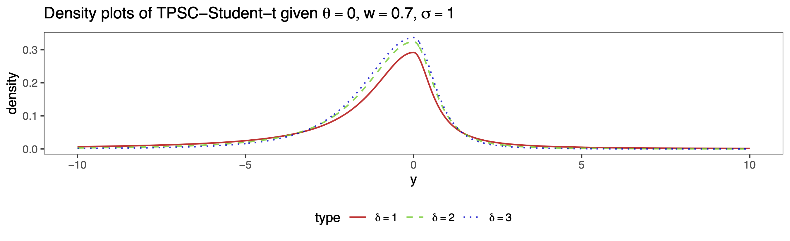
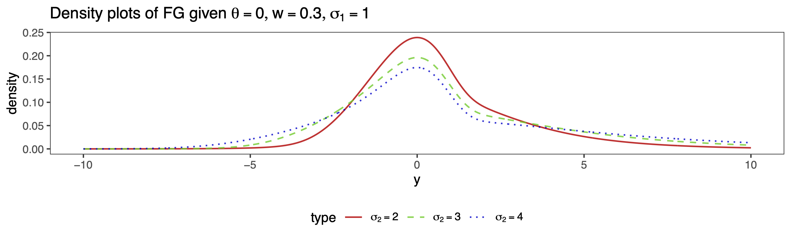

```{r setup, include=FALSE}
knitr::opts_chunk$set(echo = TRUE)
```

## Version Information

The following is the collection of information about the R session used for all simulation studies. For users who are very serious about reproducibility, please try to recreate the computation environment similar to the following. The reported statistics in the manuscript should remain **unchanged** up to one decimal place when using different computation environments.

```{r ver_info}
sessionInfo()
```

## Introduction

This `GitHub` repository is part of the supplementary material for the manuscript ["Bayesian Modal Regression Based on Mixture Distributions"](https://arxiv.org/pdf/2211.10776.pdf) authored by Drs. Qingyang Liu, Xianzheng Huang, and Ray Bai. If you find this project useful, we kindly request that you consider citing our work. 

In this project, we introduce a unified framework for Bayesian modal regression, utilizing a family of unimodal distributions indexed by the mode and other parameters, allowing for flexibility in shapes and tail behaviors. The provided density plots showcase three different distributions from the proposed family with various shape/scale parameters, all centered around a mode of 0.


{ width=70% style="display: block; margin: 0 auto;" }

{ width=70% style="display: block; margin: 0 auto;" }

{ width=70% style="display: block; margin: 0 auto;" }

{ width=70% style="display: block; margin: 0 auto;" }

{ width=70% style="display: block; margin: 0 auto;" }
