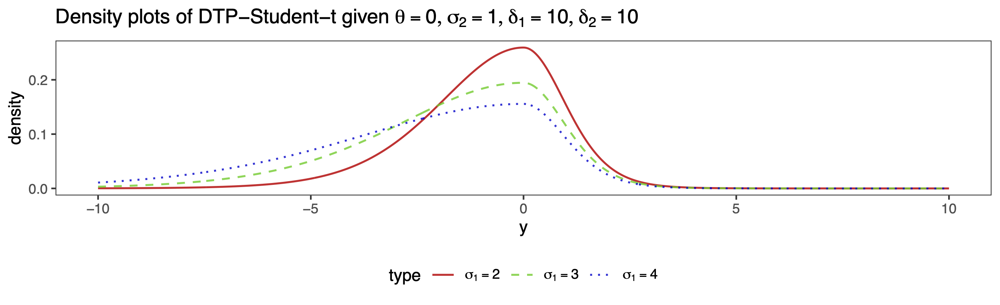
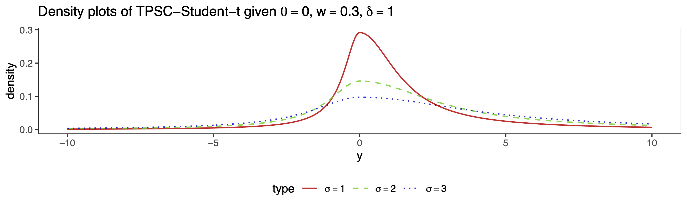
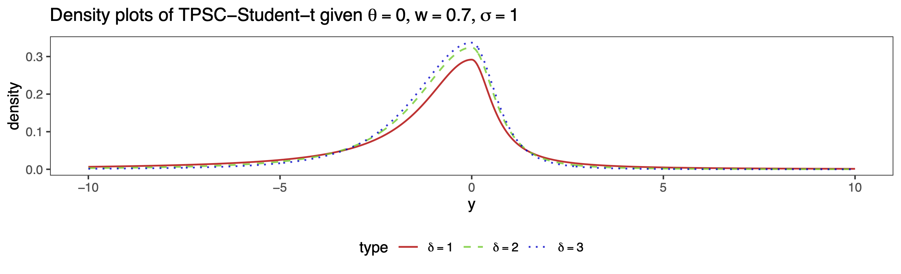
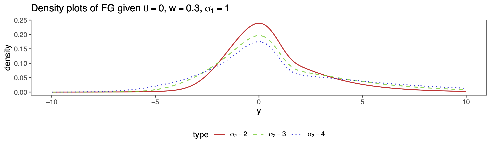
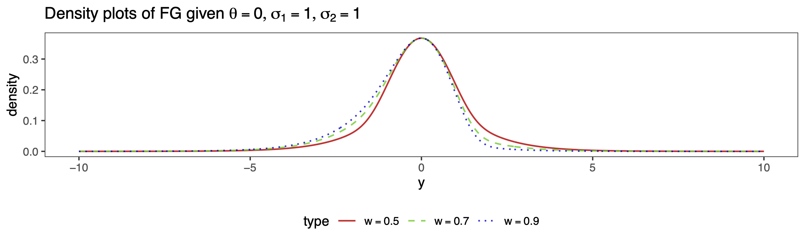

Bayesian Modal Regression Based on Mixture Distributions
================

## Version Information

The following is the collection of information about the R session used
for all simulation studies. For users who are very serious about
reproducibility, please try to recreate the computation environment
similar to the following. The reported statistics in the manuscript
should remain **unchanged** up to one decimal place when using different
computation environments.

``` r
sessionInfo()
```

    ## R version 4.3.0 (2023-04-21)
    ## Platform: aarch64-apple-darwin20 (64-bit)
    ## Running under: macOS 14.2.1
    ## 
    ## Matrix products: default
    ## BLAS:   /Library/Frameworks/R.framework/Versions/4.3-arm64/Resources/lib/libRblas.0.dylib 
    ## LAPACK: /Library/Frameworks/R.framework/Versions/4.3-arm64/Resources/lib/libRlapack.dylib;  LAPACK version 3.11.0
    ## 
    ## locale:
    ## [1] en_US.UTF-8/en_US.UTF-8/en_US.UTF-8/C/en_US.UTF-8/en_US.UTF-8
    ## 
    ## time zone: America/Chicago
    ## tzcode source: internal
    ## 
    ## attached base packages:
    ## [1] stats     graphics  grDevices utils     datasets  methods   base     
    ## 
    ## loaded via a namespace (and not attached):
    ##  [1] compiler_4.3.0    fastmap_1.1.1     cli_3.6.1         tools_4.3.0      
    ##  [5] htmltools_0.5.7   rstudioapi_0.15.0 yaml_2.3.7        rmarkdown_2.25   
    ##  [9] knitr_1.45        xfun_0.41         digest_0.6.33     rlang_1.1.2      
    ## [13] evaluate_0.23

## Introduction

This `GitHub` repository is part of the supplementary material for the
manuscript [“Bayesian Modal Regression Based on Mixture
Distributions”](https://arxiv.org/pdf/2211.10776.pdf) authored by Drs.
Qingyang Liu, Xianzheng Huang, and Ray Bai. If you find this project
useful, we kindly request that you consider citing our work.

In this project, we introduce a unified framework for Bayesian modal
regression, utilizing a family of unimodal distributions indexed by the
mode and other parameters, allowing for flexibility in shapes and tail
behaviors. The provided density plots showcase three different
distributions from the proposed family with various shape/scale
parameters, all centered around a mode of 0.










