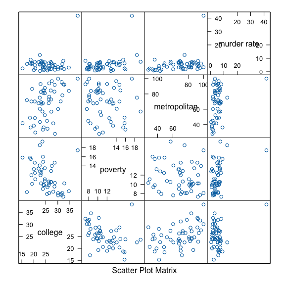

<!-- README.md is generated from README.Rmd. Please edit that file -->

## Installation

The `GUD`
[](https://CRAN.R-project.org/package=GUD)
package provides probability density functions and sampling algorithms
for three key distributions from the General Unimodal Distribution (GUD)
family: the Flexible Gumbel (FG) distribution, the Double Two-Piece
(DTP) Student-t distribution, and the Two-Piece Scale (TPSC) Student-t
distribution. Additionally, this package includes a function for
Bayesian linear modal regression, leveraging these three distributions
for model fitting.

You can install the `GUD` package:

``` r
if (! require(GUD)) {
  install.packages(pkgs = "GUD",
                   repos = "https://cran.rstudio.com/" )
} else {
  require(GUD)
}
#> Loading required package: GUD
```

## Introduction

The general unimodal distribution (GUD) family is essentially a family
of two-component mixture distributions. The probability density function
(pdf) of a member of GUD family is $$
f\left(y \mid w, \theta, \boldsymbol{\xi}_1, \boldsymbol{\xi}_2\right)=w f_1\left(y \mid \theta, \boldsymbol{\xi}_1\right)+(1-w) f_2\left(y \mid \theta, \boldsymbol{\xi}_2\right),
$$ where $w \in [0,1]$ is the weight parameter,
$\theta \in (-\infty, +\infty)$ is the mode as a location parameter,
$\boldsymbol{\xi}_1$ consists of parameters other than the location
parameter in $f_1\left(\cdot \mid \theta, \boldsymbol{\xi}_1\right)$ and
$\boldsymbol{\xi}_2$ is defined similarly for
$f_2\left(\cdot \mid \theta, \boldsymbol{\xi}_2\right)$. Besides
unimodality, all members of the GUD family share three features:

1.  The pdfs $f_1\left(\cdot \mid \theta, \boldsymbol{\xi}_1\right)$ and
    $f_2\left(\cdot \mid \theta, \boldsymbol{\xi}_2\right)$ are unimodal
    at $\theta$.
2.  The pdfs $f_1\left(\cdot \mid \theta, \boldsymbol{\xi}_1\right)$ and
    $f_2\left(\cdot \mid \theta, \boldsymbol{\xi}_2\right)$ are
    left-skewed and right-skewed respectively.
3.  The mixture pdf
    $f\left(\cdot \mid w, \theta, \boldsymbol{\xi}_1, \boldsymbol{\xi}_2\right)$
    in (1) is continuous in its domain.

More details of the GUD family can be found in [Liu, Q., Huang, X., &
Bai, R. (2024)](https://arxiv.org/abs/2211.10776).

## Bayesian Modal Regression Analysis of 2003 United States Crime Data

In this section, we demonstrate how to use the `GUD` package to analyze
2003 United States Crime Data as in Section 2 of [Liu, Q., Huang, X., &
Bai, R. (2024)](https://arxiv.org/abs/2211.10776).

In “The Art and Science of Learning from Data, 5th edition” by Alan
Agresti, Christine A. Franklin, and Bernhard Klingenberg, an interesting
example about the 2003 United States crime data is presented to
demonstrate the influence of outliers in the classic linear regression
model. This example is very compelling and partially motivates the
construction of the Bayesian modal regression based on the GUD family.
This data contains the murder rate, percentage of college education,
poverty percentage, and metropolitan rate for the 50 states in the
United States and the District of Columbia (D.C.) from 2003. The murder
rate is defined as the annual number of murders per $100{,}000$ people
in the population. The poverty percentage is the percentage of residents
with income below the poverty level, and the metropolitan rate is
defined as the percentage of population living in the metropolitan area.
In the exploratory data analysis, we present the conditional scatter
plot matrices below.

``` r
# load data crime from the GUD package
df1 <- crime
# the conditional scatter plot matrices of U.S. crime data
if (require(lattice)) {
  lattice::splom(~df1[c(6,4,9,3)],
                 main = NULL,
                 panel = function(x,y,...) {
                   panel.splom(x,y,...)
            })
}
#> Loading required package: lattice
```



In the conditional scatter plot matrices, we notice an outlier,
Washington, D.C., which stands out and does not follow the common
pattern of other states.

Next, we demonstrate how to fit the Bayesian modal regression model
based on the TPSC distribution to the 2003 United States crime data.

``` r
TPSC_model <- modal_regression(`murder rate` ~ college + poverty + metropolitan, 
                               data = df1, 
                               model = "TPSC",
                               chains = 2,
                               iter = 2000)
#> 
#> SAMPLING FOR MODEL 'TPSC' NOW (CHAIN 1).
#> Chain 1: 
#> Chain 1: Gradient evaluation took 3.2e-05 seconds
#> Chain 1: 1000 transitions using 10 leapfrog steps per transition would take 0.32 seconds.
#> Chain 1: Adjust your expectations accordingly!
#> Chain 1: 
#> Chain 1: 
#> Chain 1: Iteration:    1 / 2000 [  0%]  (Warmup)
#> Chain 1: Iteration:  200 / 2000 [ 10%]  (Warmup)
#> Chain 1: Iteration:  400 / 2000 [ 20%]  (Warmup)
#> Chain 1: Iteration:  600 / 2000 [ 30%]  (Warmup)
#> Chain 1: Iteration:  800 / 2000 [ 40%]  (Warmup)
#> Chain 1: Iteration: 1000 / 2000 [ 50%]  (Warmup)
#> Chain 1: Iteration: 1001 / 2000 [ 50%]  (Sampling)
#> Chain 1: Iteration: 1200 / 2000 [ 60%]  (Sampling)
#> Chain 1: Iteration: 1400 / 2000 [ 70%]  (Sampling)
#> Chain 1: Iteration: 1600 / 2000 [ 80%]  (Sampling)
#> Chain 1: Iteration: 1800 / 2000 [ 90%]  (Sampling)
#> Chain 1: Iteration: 2000 / 2000 [100%]  (Sampling)
#> Chain 1: 
#> Chain 1:  Elapsed Time: 1.095 seconds (Warm-up)
#> Chain 1:                0.674 seconds (Sampling)
#> Chain 1:                1.769 seconds (Total)
#> Chain 1: 
#> 
#> SAMPLING FOR MODEL 'TPSC' NOW (CHAIN 2).
#> Chain 2: 
#> Chain 2: Gradient evaluation took 1.1e-05 seconds
#> Chain 2: 1000 transitions using 10 leapfrog steps per transition would take 0.11 seconds.
#> Chain 2: Adjust your expectations accordingly!
#> Chain 2: 
#> Chain 2: 
#> Chain 2: Iteration:    1 / 2000 [  0%]  (Warmup)
#> Chain 2: Iteration:  200 / 2000 [ 10%]  (Warmup)
#> Chain 2: Iteration:  400 / 2000 [ 20%]  (Warmup)
#> Chain 2: Iteration:  600 / 2000 [ 30%]  (Warmup)
#> Chain 2: Iteration:  800 / 2000 [ 40%]  (Warmup)
#> Chain 2: Iteration: 1000 / 2000 [ 50%]  (Warmup)
#> Chain 2: Iteration: 1001 / 2000 [ 50%]  (Sampling)
#> Chain 2: Iteration: 1200 / 2000 [ 60%]  (Sampling)
#> Chain 2: Iteration: 1400 / 2000 [ 70%]  (Sampling)
#> Chain 2: Iteration: 1600 / 2000 [ 80%]  (Sampling)
#> Chain 2: Iteration: 1800 / 2000 [ 90%]  (Sampling)
#> Chain 2: Iteration: 2000 / 2000 [100%]  (Sampling)
#> Chain 2: 
#> Chain 2:  Elapsed Time: 1.028 seconds (Warm-up)
#> Chain 2:                0.591 seconds (Sampling)
#> Chain 2:                1.619 seconds (Total)
#> Chain 2:
```

### Summary of Bayesian Analysis

One can summarize the Bayesian analysis using the summary function.

``` r
print(summary(TPSC_model), n = 7)
#> # A tibble: 113 × 10
#>   variable    mean  median     sd    mad      q5     q95  rhat ess_bulk ess_tail
#>   <chr>      <dbl>   <dbl>  <dbl>  <dbl>   <dbl>   <dbl> <dbl>    <dbl>    <dbl>
#> 1 w         0.276   0.282  0.117  0.126   0.0756  0.464   1.01     368.     235.
#> 2 delta     1.90    1.78   0.677  0.566   1.09    3.15    1.01     447.     582.
#> 3 sigma     1.17    1.16   0.265  0.257   0.760   1.62    1.00     540.     343.
#> 4 (Interc…  1.13    1.31   2.73   2.69   -3.71    5.26    1.00     698.     971.
#> 5 college  -0.197  -0.201  0.0825 0.0812 -0.325  -0.0554  1.00     648.     995.
#> 6 poverty   0.244   0.248  0.138  0.147   0.0150  0.462   1.00     568.     784.
#> 7 metropo…  0.0627  0.0616 0.0143 0.0138  0.0413  0.0889  1.00     521.     640.
#> # ℹ 106 more rows
```

One can present the traceplot of the MCMC chain using the
`bayesplot::mcmc_trace` function.

``` r
if (require(bayesplot)) {
  bayesplot::mcmc_trace(TPSC_model, pars = c("(Intercept)",
                                             "college", 
                                             "poverty", 
                                             "metropolitan"))
}
#> Loading required package: bayesplot
#> Warning: package 'bayesplot' was built under R version 4.3.1
#> This is bayesplot version 1.11.1
#> - Online documentation and vignettes at mc-stan.org/bayesplot
#> - bayesplot theme set to bayesplot::theme_default()
#>    * Does _not_ affect other ggplot2 plots
#>    * See ?bayesplot_theme_set for details on theme setting
```


The summary of posterior predictive distribution can be assessed using
the following command. Here `ystar[1]` represents the posterior
prediction of the first observation in the dataset, and so on.

``` r
summary(posterior::subset_draws(TPSC_model, variable = "ystar"))
#> # A tibble: 51 × 10
#>    variable   mean median    sd   mad     q5   q95  rhat ess_bulk ess_tail
#>    <chr>     <dbl>  <dbl> <dbl> <dbl>  <dbl> <dbl> <dbl>    <dbl>    <dbl>
#>  1 ystar[1]   7.25   6.20 15.3   2.03  3.28  13.4   1.00    1791.    1717.
#>  2 ystar[2]   2.67   1.35 12.6   2.02 -1.55   9.87  1.00    2016.    1885.
#>  3 ystar[3]   7.12   6.06  7.78  1.90  3.36  12.7   1.00    1691.    2043.
#>  4 ystar[4]   6.62   5.54 11.3   2.36  2.24  12.5   1.00    1688.    1793.
#>  5 ystar[5]   7.37   6.20  8.39  1.96  3.36  13.6   1.00    1811.    1809.
#>  6 ystar[6]   3.85   2.71  6.18  2.09 -0.315 11.1   1.00    1937.    1937.
#>  7 ystar[7]   5.22   3.86 14.0   2.04  0.856 12.4   1.00    1475.    1937.
#>  8 ystar[8]   5.79   4.91  5.04  1.80  2.16  11.7   1.00    1891.    1478.
#>  9 ystar[9]   6.72   5.28 17.6   2.61  1.18  14.4   1.00    1422.    1693.
#> 10 ystar[10]  7.75   6.41 10.4   1.94  3.58  14.7   1.00    2065.    1687.
#> # ℹ 41 more rows
```

Further comparisons between mean, median, and modal regression can be
found in Section 2 of [Liu, Q., Huang, X., & Bai, R.
(2024)](https://arxiv.org/abs/2211.10776) and Section 6 of [Liu, Q.,
Huang, X., & Zhou, H. (2024)](https://www.mdpi.com/2571-905X/7/1/19).
